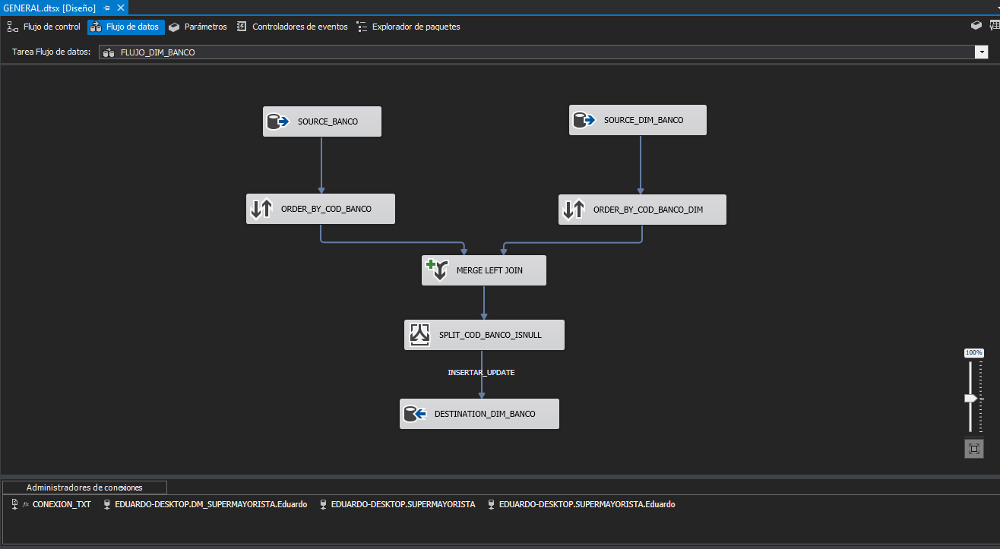
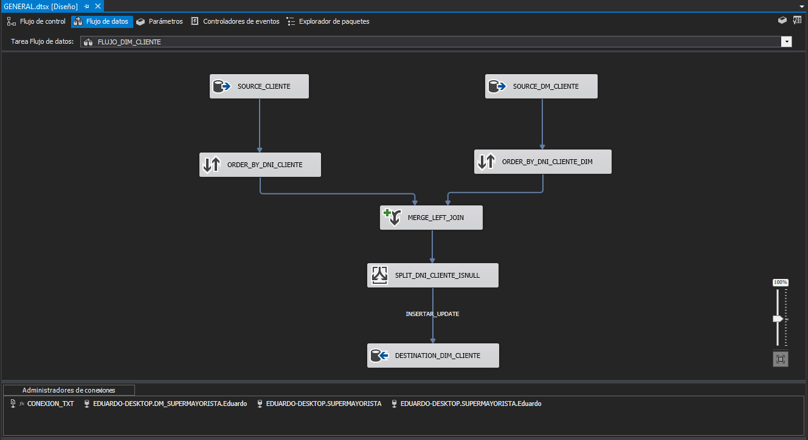

  <h1>Ingeniería de datos con SSIS</h1>

 
  

# Introducción al documento

El contenido de este documento son **apuntes teoricos y prácticos** y un proyecto **ETL** de una tienda llamada **"SUPERMAYORISTA"** y busca ser una guía para futuros trabajos personales. El mismo está hecho por mi persona [José Eduardo Galván Salvador](https://www.linkedin.com/in/eduardo-galvan1208/) para el grupo de estudio [Data Growth Community](https://www.linkedin.com/company/datagrowthcommunity/).

# Objetivos del documento

- Generar información precisa y oportuna para los usuarios finales de formal y que sea representativa para su uso en el proceso de toma decisiones.
- Analizar los datos mediante el uso de herramientas tales como PowerBi que permitirá el desarrollo de un Dashboard donde estos datos serán presentados para los usuarios finales.
- Trabajar con Power Query.
- Hacer preprocesamiento de datos para crear dashboards. 
- Extraer información de la base de datos de la empresa.

## Tabla de contenido
- [Planificación del proyecto](#Planificación-del-proyecto)
  - [Alcance del negocio](#Alcance-del-negocio)
- [Definición de requerimientos para la empresa SUPERMAYORISTA](#Definición-de-requerimientos-para-la-empresa-SUPERMAYORISTA)
  - [Requisitos del negocio](#Requisitos-del-negocio)
  - [Base de Datos transaccional en SQL Server](#Base-de-Datos-transaccional-en-SQL-Server)
  - [Diccionario de datos del origen a nivel general de la base de datos transaccional en SQL Server 2017](#Diccionario-de-datos-del-origen-a-nivel-general-de-la-base-de-datos-transaccional-en-SQL-Server-2017)
    - [Tablas](#Tablas)
    - [Diccionario de datos de la base de datos transaccional en SQL Server 2017](#Diccionario-de-datos-de-la-base-de-datos-transaccional-en-SQL-Server-2017)
      - [VENTA](#VENTA)
      - [DETALLE_VENTA](#DETALLE_VENTA)
      - [PRODUCTO](#PRODUCTO)
      - [CLIENTE](#CLIENTE)
      - [VENDEDOR](#VENDEDOR)
      - [TIPO_DOCUMENTO](#TIPO_DOCUMENTO)
- [Modelo Dimensional](#Modelo-Dimensional)
  - [Elección de dimensiones](#Elección-de-dimensiones)
- [Dimensiones encontradas](#Dimensiones-encontradas)
- [Diseño lógico](#Diseño-lógico)
- [Diseño físico](#Diseño-físico)
  - [Tablas del modelo dimensional](#Tablas-del-modelo-dimensional)

# ETL "Supermayorista" (Archivo DM_SUPERMAYORISTA.sln)

 
  
  
  
  
  
  
  
  
  
  
  
  
  
  
  
  
  

## Planificación del proyecto

### Alcance del negocio

El presente proyecto busca ayudar con la gestión del área de ventas de la empresa SuperMayorista mediante informes de análisis de la información completos, veraces y en tiempo real que permita apoyar en la toma de decisiones.

## Definición de requerimientos para la empresa SUPERMAYORISTA

### Requisitos del negocio

<table>
    <thead>
        <tr>
            <th><strong>Identificador</strong></th>
            <th><i>R-01</i></th>
            <th><strong>Nombre</strong></th>
            <th><i>TOP N V VS T</i></th>
        </tr>
    </thead>
    <tbody>
        <tr>
            <td align="center"><strong>Tipo</strong></td>
            <td align="center"><i>Funcional</i></td>
            <td align="center"><strong>Fecha</strong></td>
            <td align="center"><i>08/12/2022</i></td>
        </tr>
        <tr>
            <td align="center"><strong>Prioridad</strong></td>
            <td align="center"><i>Alta</i></td>
            <td align="center"><strong>Necesidad</strong></td>
            <td align="center"><i>Si</i></td>
        </tr>
        <tr>
            <td align="center"><strong>Descripción</strong></td>
            <td colspan=3 align="center"><i>"El total de ventas por periodo"</i></td>
        </tr>
        <tr>
            <td align="center"><strong>Datos dimensionales</strong></td>
            <td align="center"><i>Producto</i></td>
            <td align="center"><strong>Datos Hechos</strong></td>
            <td align="center"><i>Más vendidos</i></td>
        </tr>
    </tbody>
</table>

<table>
    <thead>
        <tr>
            <th><strong>Identificador</strong></th>
            <th><i>R-02</i></th>
            <th><strong>Nombre</strong></th>
            <th><i>TOP N PROD</i></th>
        </tr>
    </thead>
    <tbody>
        <tr>
            <td align="center"><strong>Tipo</strong></td>
            <td align="center"><i>Funcional</i></td>
            <td align="center"><strong>Fecha</strong></td>
            <td align="center"><i>08/12/2022</i></td>
        </tr>
        <tr>
            <td align="center"><strong>Prioridad</strong></td>
            <td align="center"><i>Alta</i></td>
            <td align="center"><strong>Necesidad</strong></td>
            <td align="center"><i>Si</i></td>
        </tr>
        <tr>
            <td align="center"><strong>Descripción</strong></td>
            <td colspan=3 align="center"><i>"Cuáles fueron los productos más vendidos"</i></td>
        </tr>
        <tr>
            <td align="center"><strong>Datos dimensionales</strong></td>
            <td align="center"><i>Periodo</i></td>
            <td align="center"><strong>Datos Hechos</strong></td>
            <td align="center"><i>Cantidad de ventas</i></td>
        </tr>
    </tbody>
</table>

<table>
    <thead>
        <tr>
            <th><strong>Identificador</strong></th>
            <th><i>R-03</i></th>
            <th><strong>Nombre</strong></th>
            <th><i>TOP N VE</i></th>
        </tr>
    </thead>
    <tbody>
        <tr>
            <td align="center"><strong>Tipo</strong></td>
            <td align="center"><i>Funcional</i></td>
            <td align="center"><strong>Fecha</strong></td>
            <td align="center"><i>08/12/2022</i></td>
        </tr>
        <tr>
            <td align="center"><strong>Prioridad</strong></td>
            <td align="center"><i>Alta</i></td>
            <td align="center"><strong>Necesidad</strong></td>
            <td align="center"><i>Si</i></td>
        </tr>
        <tr>
            <td align="center"><strong>Descripción</strong></td>
            <td colspan=3 align="center"><i>"Quiénes fueron los vendedores con las mayores ventas realizadas"</i></td>
        </tr>
        <tr>
            <td align="center"><strong>Datos dimensionales</strong></td>
            <td align="center"><i>Vendedor</i></td>
            <td align="center"><strong>Datos Hechos</strong></td>
            <td align="center"><i>Mayor cantidad de ventas</i></td>
        </tr>
    </tbody>
</table>

<table>
    <thead>
        <tr>
            <th><strong>Identificador</strong></th>
            <th><i>R-04</i></th>
            <th><strong>Nombre</strong></th>
            <th><i>TOP N S VS F</i></th>
        </tr>
    </thead>
    <tbody>
        <tr>
            <td align="center"><strong>Tipo</strong></td>
            <td align="center"><i>Funcional</i></td>
            <td align="center"><strong>Fecha</strong></td>
            <td align="center"><i>08/12/2022</i></td>
        </tr>
        <tr>
            <td align="center"><strong>Prioridad</strong></td>
            <td align="center"><i>Alta</i></td>
            <td align="center"><strong>Necesidad</strong></td>
            <td align="center"><i>Si</i></td>
        </tr>
        <tr>
            <td align="center"><strong>Descripción</strong></td>
            <td colspan=3 align="center"><i>"Quiénes fueron los supervisores que tuvieron baja efectividad (cantidad de ventas en cuerto periodo)"</i></td>
        </tr>
        <tr>
            <td align="center"><strong>Datos dimensionales</strong></td>
            <td align="center"><i>Vendedor</i></td>
            <td align="center"><strong>Datos Hechos</strong></td>
            <td align="center"><i>Cantidad de ventas</i></td>
        </tr>
    </tbody>
</table>

<table>
    <thead>
        <tr>
            <th><strong>Identificador</strong></th>
            <th><i>R-05</i></th>
            <th><strong>Nombre</strong></th>
            <th><i>TOP N V AND C</i></th>
        </tr>
    </thead>
    <tbody>
        <tr>
            <td align="center"><strong>Tipo</strong></td>
            <td align="center"><i>Funcional</i></td>
            <td align="center"><strong>Fecha</strong></td>
            <td align="center"><i>08/12/2022</i></td>
        </tr>
        <tr>
            <td align="center"><strong>Prioridad</strong></td>
            <td align="center"><i>Alta</i></td>
            <td align="center"><strong>Necesidad</strong></td>
            <td align="center"><i>Si</i></td>
        </tr>
        <tr>
            <td align="center"><strong>Descripción</strong></td>
            <td colspan=3 align="center"><i>"Cuál es la zona con maores ventas y mayores cantidades de productos vendidos"</i></td>
        </tr>
        <tr>
            <td align="center"><strong>Datos dimensionales</strong></td>
            <td align="center"><i>Zona</i></td>
            <td align="center"><strong>Datos Hechos</strong></td>
            <td align="center"><i>Mayor cantidad de ventas, mayor cantidad de productos vendidos</i></td>
        </tr>
    </tbody>
</table>

<table>
    <thead>
        <tr>
            <th><strong>Identificador</strong></th>
            <th><i>R-06</i></th>
            <th><strong>Nombre</strong></th>
            <th><i>TOP N B VS AC</i></th>
        </tr>
    </thead>
    <tbody>
        <tr>
            <td align="center"><strong>Tipo</strong></td>
            <td align="center"><i>Funcional</i></td>
            <td align="center"><strong>Fecha</strong></td>
            <td align="center"><i>08/12/2022</i></td>
        </tr>
        <tr>
            <td align="center"><strong>Prioridad</strong></td>
            <td align="center"><i>Alta</i></td>
            <td align="center"><strong>Necesidad</strong></td>
            <td align="center"><i>Si</i></td>
        </tr>
        <tr>
            <td align="center"><strong>Descripción</strong></td>
            <td colspan=3 align="center"><i>"Cuál es el banco más factible para solicitar un ajuste de comisión"</i></td>
        </tr>
        <tr>
            <td align="center"><strong>Datos dimensionales</strong></td>
            <td align="center"><i>Banco</i></td>
            <td align="center"><strong>Datos Hechos</strong></td>
            <td align="center"><i>Mayor comisión obtenida por las ventas</i></td>
        </tr>
    </tbody>
</table>

<table>
    <thead>
        <tr>
            <th><strong>Identificador</strong></th>
            <th><i>R-07</i></th>
            <th><strong>Nombre</strong></th>
            <th><i>TOP N VE VS V AND C AND M</i></th>
        </tr>
    </thead>
    <tbody>
        <tr>
            <td align="center"><strong>Tipo</strong></td>
            <td align="center"><i>Funcional</i></td>
            <td align="center"><strong>Fecha</strong></td>
            <td align="center"><i>08/12/2022</i></td>
        </tr>
        <tr>
            <td align="center"><strong>Prioridad</strong></td>
            <td align="center"><i>Alta</i></td>
            <td align="center"><strong>Necesidad</strong></td>
            <td align="center"><i>Si</i></td>
        </tr>
        <tr>
            <td align="center"><strong>Descripción</strong></td>
            <td colspan=3 align="center"><i>"El top de los vendedores que más comisionan por ventas"</i></td>
        </tr>
        <tr>
            <td align="center"><strong>Datos dimensionales</strong></td>
            <td align="center"><i>Vendedor</i></td>
            <td align="center"><strong>Datos Hechos</strong></td>
            <td align="center"><i>Mayor comisión obtenida en base a la venta</i></td>
        </tr>
    </tbody>
</table>

### Base de Datos transaccional en SQL Server

 
  

### Diccionario de datos del origen a nivel general de la base de datos transaccional en SQL Server 2017

#### Tablas

<table>
    <thead>
        <tr>
            <th>Tabla</th>
            <th>Descripción</th>
        </tr>
    </thead>
    <tbody>
        <tr>
            <td align="center"><strong>VENTA</strong></td>
            <td><i>Se registran los movimiento de las ventas realizadas.</i></td>
        </tr>
        <tr>
            <td align="center"><strong>DETALLE_VENTA</strong></td>
            <td><i>Se registran los detalle de las ventas realizadas.</i></td>
        </tr>
        <tr>
            <td align="center"><strong>PRODUCTO</strong></td>
            <td><i>Se registran los productos de la empresa.</i></td>
        </tr>
        <tr>
            <td align="center"><strong>CLIENTE</strong></td>
            <td><i>Se registran los clientes de la empresa.</i></td>
        </tr>
        <tr>
            <td align="center"><strong>VENDEDOR</strong></td>
            <td><i>Se registran los vendedores de la empresa.</i></td>
        </tr>
        <tr>
            <td align="center"><strong>TIPO_DOCUMENTO</strong></td>
            <td><i>Se registran los tipos de documentos que maneja la empresa.</i></td>
      </tr>
    </tbody>
</table>

#### Diccionario de datos de la base de datos transaccional en SQL Server 2017

##### VENTA

<table>
    <thead>
        <tr>
            <th>Nombre Columna</th>
            <th>Tipo de Dato</th>
            <th>Null Option</th>
            <th>Descripción</th>
            <th>PK</th>
            <th>FK</th>
        </tr>
    </thead>
    <tbody>
        <tr>
            <td align="center"><strong>cod_documento</strong></td>
            <td><i>Char(10)</i></td>
            <td><i>Not Null</i></td>
            <td><i>Código del documento</i></td>
            <td><i>PK</i></td>
            <td><i>-</i></td>
        </tr>
        <tr>
            <td align="center"><strong>dni_cliente</strong></td>
            <td><i>Char(8)</i></td>
            <td><i>Not Null</i></td>
            <td><i>DNI del cliente</i></td>
            <td><i>-</i></td>
            <td><i>FK</i></td>
        </tr>
        <tr>
            <td align="center"><strong>vendedor</strong></td>
            <td><i>Varchar(50)</i></td>
            <td><i>Not Null</i></td>
            <td><i>Nombre del vendedor</i></td>
            <td><i>-</i></td>
            <td><i>-</i></td>
        </tr>
        <tr>
            <td align="center"><strong>nombre_tipo_documento</strong></td>
            <td><i>Varchar(20)</i></td>
            <td><i>Not Null</i></td>
            <td><i>Nombre del tipo de documento</i></td>
            <td><i>-</i></td>
            <td><i>-</i></td>
        </tr>
        <tr>
            <td align="center"><strong>estado</strong></td>
            <td><i>Varchar(10)</i></td>
            <td><i>Not Null</i></td>
            <td><i>Estado de la venta</i></td>
            <td><i>-</i></td>
            <td><i>-</i></td>
        </tr>
        <tr>
            <td align="center"><strong>fecha_venta</strong></td>
            <td><i>datetime</i></td>
            <td><i>Not Null</i></td>
            <td><i>fecha de la venta</i></td>
            <td><i>-</i></td>
            <td><i>-</i></td>
      </tr>
    </tbody>
</table>

##### DETALLE_VENTA

<table>
    <thead>
        <tr>
            <th>Nombre Columna</th>
            <th>Tipo de Dato</th>
            <th>Null Option</th>
            <th>Descripción</th>
            <th>PK</th>
            <th>FK</th>
        </tr>
    </thead>
    <tbody>
        <tr>
            <td align="center"><strong>cod_documento</strong></td>
            <td><i>int</i></td>
            <td><i>Not Null</i></td>
            <td><i>Número de orden de compra</i></td>
            <td><i>-</i></td>
            <td><i>FK</i></td>
        </tr>
        <tr>
            <td align="center"><strong>cod_producto</strong></td>
            <td><i>Char(9)</i></td>
            <td><i>Not Null</i></td>
            <td><i>Código del producto</i></td>
            <td><i>-</i></td>
            <td><i>FK</i></td>
        </tr>
        <tr>
            <td align="center"><strong>cantidad</strong></td>
            <td><i>int</i></td>
            <td><i>Not Null</i></td>
            <td><i>Cantidad de productos vendidos</i></td>
            <td><i>-</i></td>
            <td><i>FK</i></td>
        </tr>
    </tbody>
</table>

##### PRODUCTO

<table>
    <thead>
        <tr>
            <th>Nombre Columna</th>
            <th>Tipo de Dato</th>
            <th>Null Option</th>
            <th>Descripción</th>
            <th>PK</th>
            <th>FK</th>
        </tr>
    </thead>
    <tbody>
        <tr>
            <td align="center"><strong>cod_producto</strong></td>
            <td><i>Char(9)</i></td>
            <td><i>Not Null</i></td>
            <td><i>Código del producto</i></td>
            <td><i>PK</i></td>
            <td><i>-</i></td>
        </tr>
        <tr>
            <td align="center"><strong>nombre_producto</strong></td>
            <td><i>Varchar(50)</i></td>
            <td><i>Not Null</i></td>
            <td><i>Nombre del producto</i></td>
            <td><i>-</i></td>
            <td><i>-</i></td>
        </tr>
        <tr>
            <td align="center"><strong>categoria_producto</strong></td>
            <td><i>Varchar(50)</i></td>
            <td><i>Not Null</i></td>
            <td><i>Nombre de la categoría del producto</i></td>
            <td><i>-</i></td>
            <td><i>-</i></td>
        </tr>
        <tr>
            <td align="center"><strong>subcategoria_producto</strong></td>
            <td><i>Varchar(50)</i></td>
            <td><i>Not Null</i></td>
            <td><i>Nombre de la subcategoría del producto</i></td>
            <td><i>-</i></td>
            <td><i>-</i></td>
        </tr>
        <tr>
            <td align="center"><strong>precio_unitario</strong></td>
            <td><i>decimal(8,2)</i></td>
            <td><i>Not Null</i></td>
            <td><i>Precio Unitario del producto</i></td>
            <td><i>-</i></td>
            <td><i>-</i></td>
        </tr>
    </tbody>
</table>

##### CLIENTE

<table>
    <thead>
        <tr>
            <th>Nombre Columna</th>
            <th>Tipo de Dato</th>
            <th>Null Option</th>
            <th>Descripción</th>
            <th>PK</th>
            <th>FK</th>
        </tr>
    </thead>
    <tbody>
        <tr>
            <td align="center"><strong>dni_cliente</strong></td>
            <td><i>Char(11)</i></td>
            <td><i>Not Null</i></td>
            <td><i>Código del cliente</i></td>
            <td><i>PK</i></td>
            <td><i>-</i></td>
        </tr>
        <tr>
            <td align="center"><strong>departamento_cliente</strong></td>
            <td><i>Varchar(50)</i></td>
            <td><i>Not Null</i></td>
            <td><i>Nombre del departamento</i></td>
            <td><i>-</i></td>
            <td><i>-</i></td>
        </tr>
        <tr>
            <td align="center"><strong>distrito_cliente</strong></td>
            <td><i>Varchar(50)</i></td>
            <td><i>Not Null</i></td>
            <td><i>Nombre del distrito</i></td>
            <td><i>-</i></td>
            <td><i>-</i></td>
        </tr>
        <tr>
            <td align="center"><strong>punto_geografico</strong></td>
            <td><i>Varchar(50)</i></td>
            <td><i>Not Null</i></td>
            <td><i>Punto geográfico</i></td>
            <td><i>-</i></td>
            <td><i>-</i></td>
        </tr>
        <tr>
            <td align="center"><strong>ubigeo_cliente</strong></td>
            <td><i>Varchar(50)</i></td>
            <td><i>Not Null</i></td>
            <td><i>Ubigeo del cliente</i></td>
            <td><i>-</i></td>
            <td><i>-</i></td>
        </tr>
    </tbody>
</table>

##### VENDEDOR

<table>
    <thead>
        <tr>
            <th>Nombre Columna</th>
            <th>Tipo de Dato</th>
            <th>Null Option</th>
            <th>Descripción</th>
            <th>PK</th>
            <th>FK</th>
        </tr>
    </thead>
    <tbody>
        <tr>
            <td align="center"><strong>cod_vendedor</strong></td>
            <td><i>Char(7)</i></td>
            <td><i>Not Null</i></td>
            <td><i>Código del empleado</i></td>
            <td><i>PK</i></td>
            <td><i>-</i></td>
        </tr>
        <tr>
            <td align="center"><strong>apellido_vendedor</strong></td>
            <td><i>Varchar(30)</i></td>
            <td><i>Not Null</i></td>
            <td><i>Apellido del vendedor</i></td>
            <td><i>-</i></td>
            <td><i>-</i></td>
        </tr>
        <tr>
            <td align="center"><strong>nombre_vendedor</strong></td>
            <td><i>Varchar(20)</i></td>
            <td><i>Not Null</i></td>
            <td><i>Nombre del vendedor</i></td>
            <td><i>-</i></td>
            <td><i>-</i></td>
        </tr>
        <tr>
            <td align="center"><strong>supervisor</strong></td>
            <td><i>Char(7)</i></td>
            <td><i>Not Null</i></td>
            <td><i>Apellido del empleado</i></td>
            <td><i>-</i></td>
            <td><i>-</i></td>
        </tr>
    </tbody>
</table>

##### TIPO_DOCUMENTO

<table>
    <thead>
        <tr>
            <th>Nombre Columna</th>
            <th>Tipo de Dato</th>
            <th>Null Option</th>
            <th>Descripción</th>
            <th>PK</th>
            <th>FK</th>
        </tr>
    </thead>
    <tbody>
        <tr>
            <td align="center"><strong>cod_tipo_documento</strong></td>
            <td><i>Char(6)</i></td>
            <td><i>Not Null</i></td>
            <td><i>Código del tipo de documento</i></td>
            <td><i>PK</i></td>
            <td><i>-</i></td>
        </tr>
        <tr>
            <td align="center"><strong>nombre_tipo_documento</strong></td>
            <td><i>Varchar(20)</i></td>
            <td><i>Not Null</i></td>
            <td><i>Nombre del tipo de documento</i></td>
            <td><i>-</i></td>
            <td><i>-</i></td>
        </tr>
    </tbody>
</table>

### Modelo Dimensional

Tras analizar las entrevistas y requerimientos se continuará determinando las medidas y funciones orientadas a analizar diferentes niveles de información.

#### Elección de dimensiones

Para poder determinar las dimensiones a usar en el Datamart, primero debemos elegir las variables a analizar y que los usuarios suelen utilizar para realizar sus informes. Destacan:

- [x] Fecha
- [x] Estado de la venta
- [x] Nombre del Producto
- [x] Categoría del producto
- [x] Sub categoría del producto
- [x] Nombre del vendedor
- [x] Apellido del vendedor
- [x] Supervisor del vendedor
- [x] DNI del cliente
- [x] Nombre del departamento
- [x] Nombre del distrito
- [x] Nombre del banco
- [x] Comisión del banco
- [x] Tipo de documento

<table>
    <thead>
        <tr>
            <th colspan=2 align="center">Dimensiones</th>
        </tr>
    </thead>
    <tbody>
        <tr>
            <td rowspan=3 align="center"><strong>Vendedor</strong></td>
            <td><i>Nombre-Vendedor</i></td>
        </tr>
        <tr>
            <td><i>Apellido-Vendedor</i></td>
        </tr>
        <tr>
            <td><i>Supevisor-Vendedor</i></td>
        </tr>
        <tr>
            <td align="center"><strong>Venta</strong></td>
            <td><i>Estado de la venta-Venta</i></td>
        </tr>
        <tr>
            <td align="center"><strong>Cliente</strong></td>
            <td><i>DNI-Cliente</i></td>
        </tr>
        <tr>
            <td align="center"><strong>Producto</strong></td>
            <td><i>Nombre-Producto</i></td>
        </tr>
        <tr>
            <td align="center"><strong>Subcategoría</strong></td>
            <td><i>Subcategoría-Producto</i></td>
        </tr>
        <tr>
            <td align="center"><strong>Categoría</strong></td>
            <td><i>Categoría-Producto</i></td>
        </tr>
        <tr>
            <td align="center"><strong>Distrito</strong></td>
            <td><i>Distrito-Distrito</i></td>
        </tr>
        <tr>
            <td align="center"><strong>Departamento</strong></td>
            <td><i>Departamento-Departamento</i></td>
        </tr>
        <tr>
            <td rowspan=2 align="center"><strong>Banco</strong></td>
            <td><i>Nombre-Banco</i></td>
        </tr>
        <tr>
            <td><i>Comisión-Banco</i></td>
        </tr>
        <tr>
            <td align="center"><strong>Periodo</strong></td>
            <td><i>Fecha-Periodo</i></td>
        </tr>
        <tr>
            <td align="center"><strong>Documento</strong></td>
            <td><i>Tipo-Documento</i></td>
        </tr>
    </tbody>
</table>

### Dimensiones encontradas

- [x] DIM_VENDEDOR
- [x] DIM_VENTA
- [x] DIM_CLIENTE
- [x] DIM_PRODUCTO
- [x] DIM_SUBCATEGORIA
- [x] DIM_CATEGORIA
- [x] DIM_DISTRITO
- [x] DIM_DEPARTAMENTO
- [x] DIM_BANCO
- [x] DIM_PERIODO
- [x] DIM_DOCUMENTO

### Diseño lógico

 
  

### Diseño físico

 
  

#### Tablas del modelo dimensional

<table>
    <thead>
        <tr>
            <th>Tabla</th>
            <th>Descripción</th>
        </tr>
    </thead>
    <tbody>
        <tr>
            <td align="center"><strong>FACT_SUPERMAYORISTA</strong></td>
            <td><i>Se registran los movimientos de cada una de las ventas.</i></td>
        </tr>
        <tr>
            <td align="center"><strong>DIM_VENDEDOR</strong></td>
            <td><i>Se registran los vendedores.</i></td>
        </tr>
        <tr>
            <td align="center"><strong>DIM_VENTA</strong></td>
            <td><i>Se registran las ventas realizadas y no realizadas.</i></td>
        </tr>
        <tr>
            <td align="center"><strong>DIM_CLIENTE</strong></td>
            <td><i>Se registran los clientes que interactúan con la empresa.</i></td>
        </tr>
        <tr>
            <td align="center"><strong>DIM_PRODUCTO</strong></td>
            <td><i>Se registran los productos con los que cuenta la empresa.</i></td>
        </tr>
        <tr>
            <td align="center"><strong>DIM_SUBCATEGORIA</strong></td>
            <td><i>Se registran las subcategorías a las que pertenecen los productos.</i></td>
        </tr>
        <tr>
            <td align="center"><strong>DIM_CATEGORIA</strong></td>
            <td><i>Se registran las categorías a las que pertenecen las subcategorías.</i></td>
        </tr>
        <tr>
            <td align="center"><strong>DIM_DISTRITO</strong></td>
            <td><i>Se registran los diferentes distritos de nuestro país.</i></td>
        </tr>
        <tr>
            <td align="center"><strong>DIM_DEPARTAMENTO</strong></td>
            <td><i>Se registran los diferentes departamentos de nuestro país y a los cuales los distritos pertenecen.</i></td>
        </tr>
        <tr>
            <td align="center"><strong>DIM_BANCO</strong></td>
            <td><i>Se registran los bancos con los quer trabaja la empresa.</i></td>
        </tr>
        <tr>
            <td align="center"><strong>DIM_PERIODO</strong></td>
            <td><i>Se registra el periodo en fecha, año, mes y día.</i></td>
        </tr>
        <tr>
            <td align="center"><strong>DIM_DOCUMENTO</strong></td>
            <td><i>Se registran los diferentes tipos de documentos con los que trabaja la empresa.</i></td>
        </tr>
    </tbody>
</table>

##### Tabla Hechos: FACT_SUPERMAYORISTA

FACT_SUPERMAYORISTA está conformada por:
<table>
    <thead>
        <tr>
            <th>Campo</th>
            <th>Tipo de Dato</th>
            <th>Longitud</th>
            <th>Descripción</th>
        </tr>
    </thead>
    <tbody>
        <tr>
            <td align="center"><strong>FACT_VENTA</strong></td>
            <td><i>int</i></td>
            <td><i>-</i></td>
            <td><i>Llave foránea relacionada a la dimensión Venta.</i></td>
        </tr>
        <tr>
            <td align="center"><strong>FK_CLIENTE</strong></td>
            <td><i>int</i></td>
            <td><i>-</i></td>
            <td><i>Llave foránea relacionada a la dimensión Cliente.</i></td>
        </tr>
        <tr>
            <td align="center"><strong>FK_VENDEDOR</strong></td>
            <td><i>int</i></td>
            <td><i>-</i></td>
            <td><i>Llave foránea relacionada a la dimensión Vendedor.</i></td>
        </tr>
        <tr>
            <td align="center"><strong>FK_BANCO</strong></td>
            <td><i>int</i></td>
            <td><i>-</i></td>
            <td><i>Llave foránea relacionada a la dimensión Banco.</i></td>
        </tr>
        <tr>
            <td align="center"><strong>FK_PRODUCTO</strong></td>
            <td><i>int</i></td>
            <td><i>-</i></td>
            <td><i>Llave foránea relacionada a la dimensión Producto.</i></td>
        </tr>
        <tr>
            <td align="center"><strong>FK_PERIODO</strong></td>
            <td><i>int</i></td>
            <td><i>-</i></td>
            <td><i>Llave foránea relacionada a la dimensión Periodo.</i></td>
        </tr>
        <tr>
            <td align="center"><strong>FK_TIPO_DOCUMENTO</strong></td>
            <td><i>int</i></td>
            <td><i>-</i></td>
            <td><i>Llave foránea relacionada a la dimensión Documento.</i></td>
        </tr>
        <tr>
            <td align="center"><strong>CANTIDAD_PRODUCTO</strong></td>
            <td><i>int</i></td>
            <td><i>-</i></td>
            <td><i>Cantidad del producto.</i></td>
        </tr>
        <tr>
            <td align="center"><strong>PRECIO_UNIT</strong></td>
            <td><i>float</i></td>
            <td><i>-</i></td>
            <td><i>Precio del producto.</i></td>
        </tr>
    </tbody>
</table>

##### Dimensión vendedor: DIM_VENDEDOR

La dimensión DIM_VENDEDOR está conformada por:
<table>
    <thead>
        <tr>
            <th>Campo</th>
            <th>Tipo de Dato</th>
            <th>Longitud</th>
            <th>Descripción</th>
        </tr>
    </thead>
    <tbody>
        <tr>
            <td align="center"><strong>VENDEDOR_KEY</strong></td>
            <td><i>int</i></td>
            <td><i>-</i></td>
            <td><i>Llave para la dimnesión vendedor.</i></td>
        </tr>
        <tr>
            <td align="center"><strong>CODIGO_VENDEDOR</strong></td>
            <td><i>Varchar</i></td>
            <td><i>9</i></td>
            <td><i>Código para la dimensión vendedor.</i></td>
        </tr>
        <tr>
            <td align="center"><strong>NOMBRE_VENDEDOR</strong></td>
            <td><i>Varchar</i></td>
            <td><i>65</i></td>
            <td><i>Nombre del vendedor.</i></td>
        </tr>
        <tr>
            <td align="center"><strong>SUPERVISOR</strong></td>
            <td><i>int</i></td>
            <td><i>-</i></td>
            <td><i>Número del supervisor.</i></td>
        </tr>
    </tbody>
</table>

##### Dimensión venta: DIM_VENTA

La dimensión DIM_VENTA está conformada por:
<table>
    <thead>
        <tr>
            <th>Campo</th>
            <th>Tipo de Dato</th>
            <th>Longitud</th>
            <th>Descripción</th>
        </tr>
    </thead>
    <tbody>
        <tr>
            <td align="center"><strong>VENTA_KEY</strong></td>
            <td><i>int</i></td>
            <td><i>-</i></td>
            <td><i>Llave para la dimnesión venta.</i></td>
        </tr>
        <tr>
            <td align="center"><strong>COD_VENTA</strong></td>
            <td><i>Varchar</i></td>
            <td><i>13</i></td>
            <td><i>Código para la dimensión venta.</i></td>
        </tr>
        <tr>
            <td align="center"><strong>ESTADO</strong></td>
            <td><i>Varchar</i></td>
            <td><i>13</i></td>
            <td><i>Nombre del estado de la venta.</i></td>
        </tr>
    </tbody>
</table>

##### Dimensión cliente: DIM_CLIENTE

La dimensión DIM_CLIENTE está conformada por:
<table>
    <thead>
        <tr>
            <th>Campo</th>
            <th>Tipo de Dato</th>
            <th>Longitud</th>
            <th>Descripción</th>
        </tr>
    </thead>
    <tbody>
        <tr>
            <td align="center"><strong>DNI_CLIENTE</strong></td>
            <td><i>Varchar</i></td>
            <td><i>14</i></td>
            <td><i>Llave para la dimnesión cliente.</i></td>
        </tr>
        <tr>
            <td align="center"><strong>FK_DISTRITO</strong></td>
            <td><i>int</i></td>
            <td><i>-</i></td>
            <td><i>Llave foránea de la dimensión cliente.</i></td>
        </tr>
    </tbody>
</table>

##### Dimensión producto: DIM_PRODUCTO

La dimensión DIM_PRODUCTO está conformada por:
<table>
    <thead>
        <tr>
            <th>Campo</th>
            <th>Tipo de Dato</th>
            <th>Longitud</th>
            <th>Descripción</th>
        </tr>
    </thead>
    <tbody>
        <tr>
            <td align="center"><strong>PRODUCTO_KEY</strong></td>
            <td><i>int</i></td>
            <td><i>-</i></td>
            <td><i>Llave para la dimnesión producto.</i></td>
        </tr>
        <tr>
            <td align="center"><strong>COD_PRODUCTO</strong></td>
            <td><i>Varchar</i></td>
            <td><i>12</i></td>
            <td><i>Código para la dimensión producto.</i></td>
        </tr>
        <tr>
            <td align="center"><strong>NOMBRE_PRODUCTO</strong></td>
            <td><i>Varchar</i></td>
            <td><i>195</i></td>
            <td><i>Nombre del producto.</i></td>
        </tr>
        <tr>
            <td align="center"><strong>FK_SUPERCATEGORIA</strong></td>
            <td><i>int</i></td>
            <td><i>-</i></td>
            <td><i>Llave foránea para la dimensión producto.</i></td>
        </tr>
    </tbody>
</table>

##### Dimensión subcategoría: DIM_SUBCATEGORIA

La dimensión DIM_SUBCATEGORIA está conformada por:
<table>
    <thead>
        <tr>
            <th>Campo</th>
            <th>Tipo de Dato</th>
            <th>Longitud</th>
            <th>Descripción</th>
        </tr>
    </thead>
    <tbody>
        <tr>
            <td align="center"><strong>SUBCATEGORIA_KEY</strong></td>
            <td><i>int</i></td>
            <td><i>-</i></td>
            <td><i>Llave para la dimnesión subcategoría.</i></td>
        </tr>
        <tr>
            <td align="center"><strong>DESCRIPCION</strong></td>
            <td><i>Varchar</i></td>
            <td><i>65</i></td>
            <td><i>Descripción para la dimensión subcategoría.</i></td>
        </tr>
        <tr>
            <td align="center"><strong>FK_CATEGORIA</strong></td>
            <td><i>int</i></td>
            <td><i>-</i></td>
            <td><i>Llave foránea para la dimensión subcategoría</i></td>
        </tr>
    </tbody>
</table>

##### Dimensión categoría: DIM_CATEGORIA

La dimensión DIM_CATEGORIA está conformada por:
<table>
    <thead>
        <tr>
            <th>Campo</th>
            <th>Tipo de Dato</th>
            <th>Longitud</th>
            <th>Descripción</th>
        </tr>
    </thead>
    <tbody>
        <tr>
            <td align="center"><strong>CATEGORIA_KEY</strong></td>
            <td><i>int</i></td>
            <td><i>-</i></td>
            <td><i>Llave para la dimnesión categoría.</i></td>
        </tr>
        <tr>
            <td align="center"><strong>DESCRIPCION</strong></td>
            <td><i>Varchar</i></td>
            <td><i>65</i></td>
            <td><i>Nombre de la categoría.</i></td>
        </tr>
    </tbody>
</table>

##### Dimensión distrito: DIM_DISTRITO

La dimensión DIM_DISTRITO está conformada por:
<table>
    <thead>
        <tr>
            <th>Campo</th>
            <th>Tipo de Dato</th>
            <th>Longitud</th>
            <th>Descripción</th>
        </tr>
    </thead>
    <tbody>
        <tr>
            <td align="center"><strong>DISTRITO_KEY</strong></td>
            <td><i>int</i></td>
            <td><i>-</i></td>
            <td><i>Llave para la dimnesión producto.</i></td>
        </tr>
        <tr>
            <td align="center"><strong>NOMBRE_DISTRITO</strong></td>
            <td><i>Varchar</i></td>
            <td><i>65</i></td>
            <td><i>Nombre del distrito.</i></td>
        </tr>
        <tr>
            <td align="center"><strong>UBIGEO</strong></td>
            <td><i>Varchar</i></td>
            <td><i>13</i></td>
            <td><i>Código del producto.</i></td>
        </tr>
        <tr>
            <td align="center"><strong>NOMBRE_DISTRITO</strong></td>
            <td><i>Varchar</i></td>
            <td><i>65</i></td>
            <td><i>Número del distrito.</i></td>
        </tr>
        <tr>
            <td align="center"><strong>FK_DEPARTAMERNTO</strong></td>
            <td><i>Varchar</i></td>
            <td><i>65</i></td>
            <td><i>Llave foránea para la dimensión distrito.</i></td>
        </tr>
    </tbody>
</table>

##### Dimensión departamento: DIM_DEPARTAMENTO

La dimensión DIM_DEPARTAMENTO está conformada por:
<table>
    <thead>
        <tr>
            <th>Campo</th>
            <th>Tipo de Dato</th>
            <th>Longitud</th>
            <th>Descripción</th>
        </tr>
    </thead>
    <tbody>
        <tr>
            <td align="center"><strong>DEPARTAMENTO_KEY</strong></td>
            <td><i>int</i></td>
            <td><i>-</i></td>
            <td><i>Llave para la dimnesión departamento.</i></td>
        </tr>
        <tr>
            <td align="center"><strong>NOMBRE_DEPARTAMENTO</strong></td>
            <td><i>Varchar</i></td>
            <td><i>65</i></td>
            <td><i>Nombre del departamento.</i></td>
        </tr>
    </tbody>
</table>

##### Dimensión banco: DIM_BANCO

La dimensión DIM_BANCO está conformada por:
<table>
    <thead>
        <tr>
            <th>Campo</th>
            <th>Tipo de Dato</th>
            <th>Longitud</th>
            <th>Descripción</th>
        </tr>
    </thead>
    <tbody>
        <tr>
            <td align="center"><strong>BANCO_KEY</strong></td>
            <td><i>int</i></td>
            <td><i>-</i></td>
            <td><i>Llave para la dimnesión banco.</i></td>
        </tr>
        <tr>
            <td align="center"><strong>COD_BANCO</strong></td>
            <td><i>Varchar</i></td>
            <td><i>7</i></td>
            <td><i>Código del banco.</i></td>
        </tr>
        <tr>
            <td align="center"><strong>NOMBRE_BANCO</strong></td>
            <td><i>Varchar</i></td>
            <td><i>65</i></td>
            <td><i>Nombre del banco.</i></td>
        </tr>
        <tr>
            <td align="center"><strong>COMISION</strong></td>
            <td><i>float</i></td>
            <td><i>-</i></td>
            <td><i>Comisión según sea el banco.</i></td>
        </tr>
    </tbody>
</table>

##### Dimensión periodo: DIM_PERIODO

La dimensión DIM_PERIODO está conformada por:
<table>
    <thead>
        <tr>
            <th>Campo</th>
            <th>Tipo de Dato</th>
            <th>Longitud</th>
            <th>Descripción</th>
        </tr>
    </thead>
    <tbody>
        <tr>
            <td align="center"><strong>PERIODO_KEY</strong></td>
            <td><i>int</i></td>
            <td><i>-</i></td>
            <td><i>Llave para la dimnesión producto.</i></td>
        </tr>
        <tr>
            <td align="center"><strong>FECHA</strong></td>
            <td><i>date</i></td>
            <td><i>-</i></td>
            <td><i>Fecha de la venta.</i></td>
        </tr>
        <tr>
            <td align="center"><strong>ANIO</strong></td>
            <td><i>int</i></td>
            <td><i>-</i></td>
            <td><i>Año de la venta.</i></td>
        </tr>
        <tr>
            <td align="center"><strong>MES</strong></td>
            <td><i>int</i></td>
            <td><i>-</i></td>
            <td><i>Mes de la venta.</i></td>
        </tr>
        <tr>
            <td align="center"><strong>DIA</strong></td>
            <td><i>int</i></td>
            <td><i>-</i></td>
            <td><i>Día de la venta.</i></td>
        </tr>
    </tbody>
</table>

##### Dimensión documento: DIM_DOCUMENTO

La dimensión DIM_DOCUMENTO está conformada por:
<table>
    <thead>
        <tr>
            <th>Campo</th>
            <th>Tipo de Dato</th>
            <th>Longitud</th>
            <th>Descripción</th>
        </tr>
    </thead>
    <tbody>
        <tr>
            <td align="center"><strong>DOCUMENTO_KEY</strong></td>
            <td><i>int</i></td>
            <td><i>-</i></td>
            <td><i>Llave para la dimnesión documento.</i></td>
        </tr>
        <tr>
            <td align="center"><strong>COD_TIPO_DOCUMENTO</strong></td>
            <td><i>Varchar</i></td>
            <td><i>8</i></td>
            <td><i>Código del tipo de documento.</i></td>
        </tr>
        <tr>
            <td align="center"><strong>NOMBRE_TIPO_DOCUMENTO</strong></td>
            <td><i>Varchar</i></td>
            <td><i>26</i></td>
            <td><i>Nombre del tipo de documento.</i></td>
        </tr>
        <tr>
            <td align="center"><strong>INDICADOR</strong></td>
            <td><i>Varchar</i></td>
            <td><i>1</i></td>
            <td><i>Indicador del tipo de documento.</i></td>
        </tr>
    </tbody>
</table>
